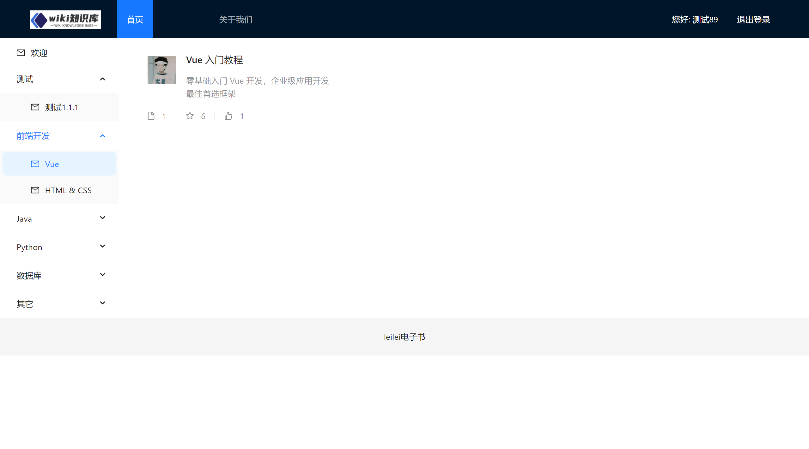

# Wiki知识库项目 - README.md

## 项目简介
欢迎来到Wiki知识库项目的README文件。本项目旨在创建一个易于使用、功能丰富且高效的在线知识管理平台，为用户提供了一个集中管理和分享信息的空间。通过这个平台，用户可以轻松地创建、编辑和浏览各种主题的知识条目，促进团队协作和个人学习。

## 快速开始

### 环境准备
在开始之前，请确保你的开发环境中已经安装了以下工具：
- **Node.js 和 npm**（用于前端开发）
- **Java 1.8+** 和 **Maven**（用于后端开发）

### 前端安装与运行
进入前端项目目录，并按照以下步骤操作：

```bash
# 克隆仓库
git clone <repository-url>

# 进入前端项目目录
cd wiki-frontend

# 安装依赖
npm install

# 启动开发服务器
npm run serve-dev
```

此时，浏览器将自动打开一个新的标签页，并访问`http://localhost:8080`来展示你正在开发的Wiki知识库应用。

### 后端安装与运行
进入后端项目目录，并按照以下步骤操作：

```bash
# 进入后端项目目录
cd wiki-backend

# 构建并运行项目
mvn clean install
mvn spring-boot:run
```

### 生产部署
当你准备部署应用时，可以分别对前端和后端进行构建和部署：

#### 前端生产构建
```bash
# 在前端项目目录下执行
npm run build
```

这将会在`dist`目录下生成优化后的静态资源文件，你可以将其部署到任何支持静态文件托管的服务上。

#### 后端生产构建
```bash
# 在后端项目目录下执行
mvn clean package -DskipTests
```

这将会生成一个可执行的JAR文件，你可以通过命令行运行它或者部署到服务器上。

### 代码检查与修复
为了保持代码质量，我们推荐定期运行代码风格检查工具。可以通过下面的命令来自动修复一些常见的代码格式问题：

#### 前端代码检查
```bash
npm run lint
```

#### 后端代码检查
后端项目中使用了Maven的编译插件来确保代码遵循Java 1.8标准，并指定了UTF-8编码。

### 自定义配置
如果你需要对默认配置进行调整，可以参考以下文档来了解如何修改配置文件：
- **前端**: [Vue CLI Configuration Reference](https://cli.vuejs.org/config/)
- **后端**: [Spring Boot Documentation](https://docs.spring.io/spring-boot/docs/current/reference/html/)

## 项目截图




## 技术栈

### 前端技术栈
- **前端框架**: Vue.js
- **状态管理**: Vuex (如果适用)
- **路由管理**: Vue Router (如果适用)
- **样式框架**: [具体使用的CSS预处理器或框架]
- **构建工具**: Webpack (通过Vue CLI)
- **其他**: [列出任何其他的库或工具]

### 后端技术栈
- **编程语言**: Java (版本1.8)
- **框架和库**:
    - **Spring Boot**: 用于创建独立的、生产级别的基于Spring的应用程序。版本为2.4.2。
    - **MyBatis**: 一个支持自定义SQL查询、存储过程和高级映射的持久层框架。通过`mybatis-spring-boot-starter`集成到Spring Boot中，版本为2.1.3。
    - **MySQL**: 使用`mysql-connector-java`作为JDBC驱动来连接MySQL数据库，版本为8.0.31。
    - **AOP (面向切面编程)**: 通过`spring-boot-starter-aop`提供，用于实现日志记录、性能监控等功能。
    - **FastJSON**: Alibaba开发的快速JSON解析器，用于Java对象与JSON格式之间的转换，版本为1.2.70。
    - **Bean Validation**: 通过`spring-boot-starter-validation`引入，提供了JSR 303/JSR 349标准的验证功能。
    - **PageHelper**: 一款分页插件，适用于MyBatis，简化了分页逻辑的实现，版本为1.2.13。
    - **Redis**: 通过`spring-boot-starter-data-redis`集成，用于缓存、会话管理等场景。
    - **WebSocket**: 通过`spring-boot-starter-websocket`添加对WebSocket的支持，以实现实时通信功能。

- **工具**:
    - **Maven**: 项目构建工具，负责依赖管理和构建生命周期。
    - **MyBatis Generator**: 自动生成MyBatis所需的实体类、Mapper接口以及XML映射文件的插件，配置在`pom.xml`中。

- **其他**:
    - **Spring Boot DevTools**: 提供开发者工具，如自动重启、属性覆盖等，方便开发环境下的调试，但不包含在生产环境中（标记为`optional`）。
    - **Spring Boot Test**: 包含了测试所需的各种依赖，如JUnit、Mockito等，用于编写单元测试和集成测试，仅在测试范围内有效。

## 贡献指南
我们非常欢迎任何形式的贡献！无论是报告bug、提出新特性建议还是直接提交pull request，都请遵循我们的[贡献者指南](CONTRIBUTING.md)中的说明进行操作。

## 后端代码
详情参见[wiki-backend]([LICENSE](https://github.com/programmerloverun/wiki_backend))。

